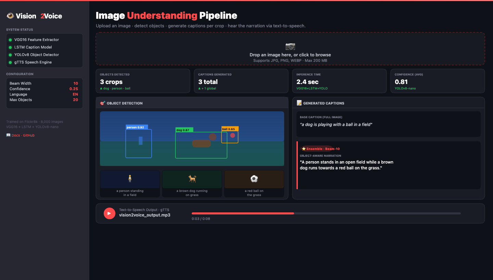
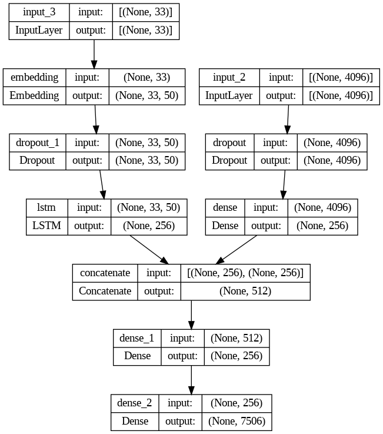

# Vision2Voice

> AI-powered image understanding pipeline that bridges visual perception and spoken language — combining deep CNNs, sequence models, object detection, and text-to-speech into a single cohesive system.

[](https://github.com/Aniruddh-11-stack/Vision2Voice-Understanding-Images-using-Deep-Learning-Computer-Vision-and-Text-to-Speech/actions/workflows/ci.yml)
[](https://github.com/Aniruddh-11-stack/Vision2Voice-Understanding-Images-using-Deep-Learning-Computer-Vision-and-Text-to-Speech/actions/workflows/docker-build.yml)
[](https://www.python.org)
[](LICENSE)



## Model Architecture

The model uses a dual-input architecture combining:
- **Image encoder**: VGG16 (4096-dim features) -> Dense(256)
- **Language model**: Embedding + LSTM (256-dim)
- **Fusion**: Concatenate -> Dense(256) -> Dense(vocab_size, softmax)



## Features

- **Image Captioning** — VGG16 + LSTM generates natural language descriptions
- **Object Detection** — YOLOv8-nano detects and crops objects in the scene
- **Ensemble Captions** — Per-crop captions combined into a coherent narration
- **Text-to-Speech** — gTTS converts captions to spoken audio (MP3)
- **Web Interface** — Streamlit app with real-time inference and audio playback
- **Docker Support** — Containerised deployment with a single command
- **CI/CD Pipeline** — GitHub Actions for linting, testing, and Docker builds

## Pipeline

```
Image Input
     |
     v
VGG16 Feature Extractor  -->  4096-dim feature vector
     |
     v
Dense(256)   +   LSTM Caption Model
     |               |
     +-------+-------+
             |
             v
       Concatenate(512)
             |
             v
       Dense(256) -> Dense(vocab_size, softmax)
             |
             v
     N Generated Captions
             |
             v
   YOLOv8 Object Detection
             |
             v
     Per-crop Captioning
             |
             v
   gTTS Text-to-Speech
             |
             v
     Audio Output (MP3)
```

## Quick Start

### Prerequisites

- Python 3.9, 3.10, or 3.11
- pip or conda

### Installation

```bash
git clone https://github.com/Aniruddh-11-stack/Vision2Voice-Understanding-Images-using-Deep-Learning-Computer-Vision-and-Text-to-Speech.git
cd Vision2Voice-Understanding-Images-using-Deep-Learning-Computer-Vision-and-Text-to-Speech
pip install -r requirements.txt
```

### Run the App

```bash
streamlit run src/app.py
```

### Run with Docker

```bash
docker build -t vision2voice .
docker run -p 8501:8501 vision2voice
```

## Project Structure

```
Vision2Voice/
|
+-- src/
|   +-- vision2voice/           # Core Python package
|   |   +-- __init__.py
|   |   +-- predictor.py        # Vision2VoicePredictor (VGG16 + LSTM + YOLO)
|   |   +-- audio.py            # TextToSpeechEngine (gTTS wrapper)
|   |   +-- utils/
|   |       +-- __init__.py
|   |       +-- image_utils.py  # Preprocessing helpers
|   +-- app.py                  # Streamlit entry point
|
+-- tests/
|   +-- unit/                   # Fast, dependency-free unit tests
|   |   +-- test_image_utils.py
|   |   +-- test_audio.py
|   |   +-- test_predictor.py
|   +-- integration/            # Full-pipeline tests (requires model weights)
|       +-- test_pipeline.py
|
+-- docs/
|   +-- screenshots/
|   |   +-- app_demo.png
|   +-- model_architecture.png
|   +-- dataset.md
|
+-- data/
|   +-- descriptions.txt        # Flickr8k image captions (3,303 entries)
|   +-- README.md
|
+-- configs/
|   +-- default.yaml            # Runtime configuration
|
+-- scripts/
|   +-- run.sh                  # Linux/macOS launcher
|   +-- run.bat                 # Windows launcher
|
+-- .flake8                     # Linter config
+-- .gitignore
+-- .pre-commit-config.yaml     # Pre-commit hooks
+-- Dockerfile
+-- docker-compose.yml
+-- requirements.txt
+-- setup.py
+-- README.md
```

## Dataset

The model is trained on [Flickr8k](https://www.kaggle.com/datasets/adityajn105/flickr8k) — 8,091 images each with 5 human-written captions.

- Training captions: `data/descriptions.txt` (3,303 entries in this repo)
- Full dataset: available on Kaggle
- Model weights: stored externally (Hugging Face Hub / GitHub Releases)

## Configuration

Edit `configs/default.yaml` to adjust runtime behaviour:

| Parameter | Default | Description |
|-----------|---------|-------------|
| `beam_width` | 10 | Beam search width for caption generation |
| `confidence` | 0.25 | YOLOv8 detection confidence threshold |
| `max_objects` | 20 | Maximum objects to detect per image |
| `language` | en | TTS language code |

## CI / CD

| Workflow | Trigger | Description |
|----------|---------|-------------|
| CI — Lint & Test | Push / PR to main | Runs flake8, black, isort, pytest |
| Docker — Build & Push | Release tag | Builds and pushes Docker image to registry |

## Contributing

1. Fork the repo
2. Create a feature branch: `git checkout -b feature/my-feature`
3. Commit your changes: `git commit -m "feat: add my feature"`
4. Push to the branch: `git push origin feature/my-feature`
5. Open a pull request

Please run `pre-commit install` before committing to ensure code quality checks pass.

## License

This project is licensed under the MIT License — see [LICENSE](LICENSE) for details.
