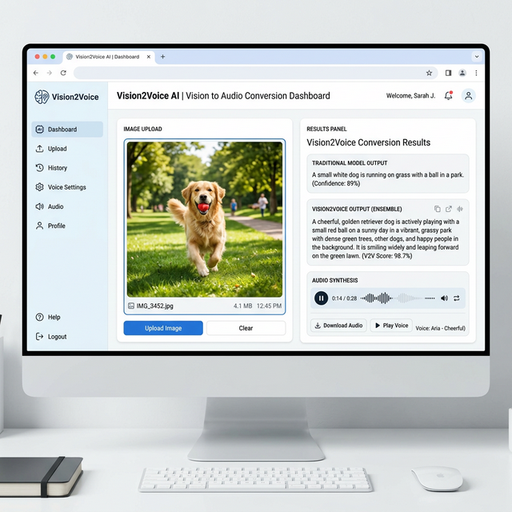

# Vision2Voice: Understanding Images using Deep Learning, Computer Vision, and Text-to-Speech

Vision2Voice is an AI-powered image analysis pipeline that bridges the gap between traditional image captioning and deep, object-level scene understanding. It uses bounding boxes to crop objects, caption them independently, aggregate the context, and dictate it aloud via text-to-speech.



### 🌟 Core Technologies
- **Object Detection**: Ultralytics YOLOv8 for precise entity cropping.
- **Deep Feature Extraction**: VGG16 (CNN) pretrained on ImageNet.
- **Sequence Generation**: LSTM (RNN) with Beam Search generating descriptions.
- **Speech Synthesis**: Google Text-to-Speech (gTTS) for output dictation.
- **User Interface**: Streamlit for a fast, responsive local dashboard.

---

## 🚀 Setup & Execution (Local Windows/Linux)

The project has been refactored from Colab-dependent notebooks into a clean, modular Python architecture that runs directly on your local system with GPU support (if configured).

### 1. Prerequisites (Model Weights)
Due to size limits, you must supply the pretrained weights and tokenizer files in the generated `models/` directory for the application to run.
Specifically, `modelConcat_1_89.h5` and `caption_train_tokenizer.pkl` must be placed inside the `models/` folder.

### 2. Fast Launch (Windows Users)
You can automatically create your virtual environment, install the dependencies, and launch the Streamlit server using the setup script:
```cmd
run_vision2voice.bat
```

### 3. Manual Launch (Linux / Mac / Windows Pro)
```bash
# Create a virtual environment
python -m venv venv
source venv/Scripts/activate # Or venv/bin/activate on Mac/Linux

# Install Requirements
pip install -r requirements.txt

# Run the Streamlit Interface
streamlit run app.py
```

## 📖 Project Structure
- `app.py`: The Streamlit dashboard and UI entry point.
- `model.py`: The core Vision2Voice ensemble pipeline (VGG16 + LSTM + YOLO logic).
- `requirements.txt`: Lightweight pip dependency checklist.
- `models/`: The required destination directory for your pretrained `.h5` model and tokenizer weights. (You must manually deposit weights here).
- `Project.ipynb`: The original comprehensive model training and research notebook.
